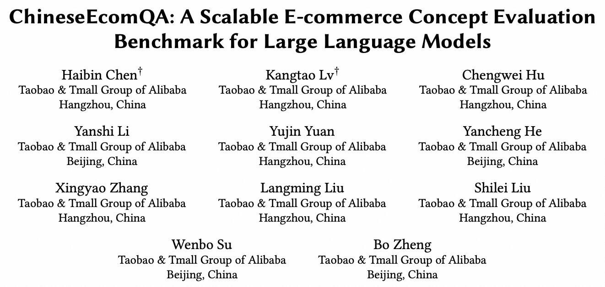

# Overview


<p align="center">
  
</p>


**ChineseEcomQA** a scalable question-answering benchmark focused on fundamental e-commerce concepts. Specifically, our benchmark is built on three core characteristics: Focus on **Fundamental Concept**, **E-commerce Generality** and **E-commerce Expertise**.

 Please visit our [website](https://github.com/OpenStellarTeam/ChineseEcomQA/tree/main) or check our [paper](https://arxiv.org/abs/2502.20196) for more details. 


## 🆕 News

- **\[2025.3.5]** We have released the ChineseEcomQA dataset. 
- The comprehensive Detailed Introduction will be released after soon. **Stay tuned** 🔥🔥🔥


## 💫 Instroduction

With the increasing use of Large Language Models (LLMs) in fields such as e-commerce, domain-specific concept evaluation benchmarks are crucial for assessing their domain capabilities. Existing LLMs may generate factually incorrect information within the complex e-commerce applications. Therefore, it is necessary to build an e-commerce concept benchmark. Existing benchmarks encounter two primary challenges:

 (1) handle the heterogeneous and diverse nature of tasks

 (2) distinguish between generality and specificity

within the e-commerce field. To address these problems, we propose ChineseEcomQA, a scalable question-answering benchmark focused on fundamental e-commerce concepts. 

**ChineseEcomQA** is built on three core characteristics: Focus on **Fundamental Concept**, **E-commerce Generality** and **E-commerce Expertise**. Fundamental concepts are designed to be applicable across a diverse array of e-commerce tasks, thus addressing the challenge of heterogeneity and diversity. Additionally, by carefully balancing generality and specificity, ChineseEcomQA effectively differentiates between broad e-commerce concepts, allowing for precise validation of domain capabilities. 

We achieve this through a scalable benchmark construction process that combines LLM validation, Retrieval-Augmented Generation (RAG) validation, and rigorous manual annotation. Based on ChineseEcomQA, we conduct extensive evaluations on mainstream LLMs and provide some valuable insights. We hope that ChineseEcomQA could guide future domain-specific evaluations, and facilitate broader LLM adoption in e-commerce applications.


## 🛠️ Setup

Due to the optional dependencies, we're not providing a unified setup mechanism. Instead, we're providing instructions for each eval and sampler.

For [HumanEval](https://github.com/openai/human-eval/) (python programming)

```bash
git clone https://github.com/openai/human-eval
pip install -e human-eval
```

For the [OpenAI API](https://pypi.org/project/openai/):

```bash
pip install openai
```

For the [Anthropic API](https://docs.anthropic.com/claude/docs/quickstart-guide):

```bash
pip install anthropic
```

For the [GLM API](https://www.bigmodel.cn/dev/api/normal-model/glm-4):

```bash
pip install zhipuai
```


## ⚖️ Evals


## Citation

Please cite our paper if you use our dataset.

```
@misc{chen2025chineseecomqascalableecommerceconcept,
      title={ChineseEcomQA: A Scalable E-commerce Concept Evaluation Benchmark for Large Language Models}, 
      author={Haibin Chen and Kangtao Lv and Chengwei Hu and Yanshi Li and Yujin Yuan and Yancheng He and Xingyao Zhang and Langming Liu and Shilei Liu and Wenbo Su and Bo Zheng},
      year={2025},
      eprint={2502.20196},
      archivePrefix={arXiv},
      primaryClass={cs.CL},
      url={https://arxiv.org/abs/2502.20196}, 
}
```
